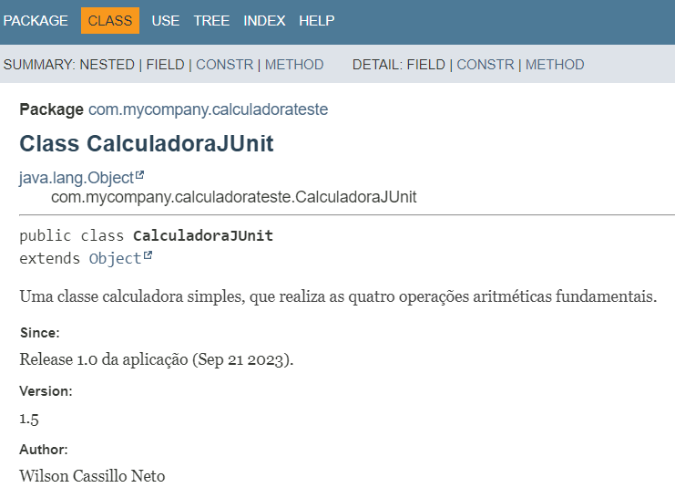
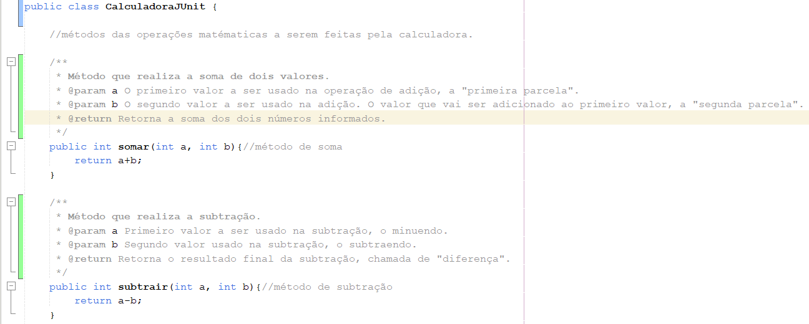

# Documentação Calculadora - Planejamento de Testes (Qualidade e Testes Software)
Atividade da Máteria de Qualidade e Testes de Software, onde pegando como base, a atividade anteriormente desenvolvida da Calculadora com testes JUnit, deveriamos documentar toda a classe da calculadora em Javadoc.

## Descrição
Este projeto é desenvolvido em Java e faz uso do framework JUnit 5. O projeto se trata de um exercício sobre Testes Automatizados, na disciplina de Qualidade e Testes de Software no curso de Tecnologia em Análise e Desenvolvimento de Sistemas.

## Conteúdo
A Calculadora é capaz de realizar as quatro operações matemáticas básicas:
- Adição
- Subtração
- Divisão
- Multiplicaçã0
Além disso, há também uma classe de testes (JUnit 5) que testa diversos cenários diferentes para cada uma das operações da calculadora.

## Última Atualização 28/10/2023
